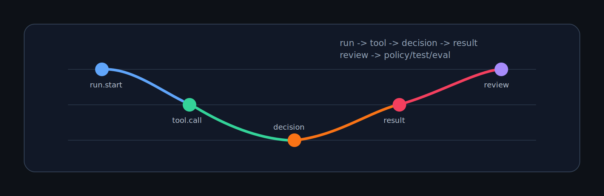

<p align="center">
  
</p>
<p align="center"><sub><em>The frame is the harness. The trace is what lets the next agent understand the run.</em></sub></p>

<p align="center">
  <a href="https://github.com/Arakiss/traceframe/actions/workflows/ci.yml"></a>
  <a href="LICENSE"></a>
  <a href="Cargo.toml"></a>
  <a href="examples/agent-run.traceframe.jsonl"></a>
  <a href="README.md"></a>
</p>

# traceframe

> _Agents do not need more autonomy before they have inspectable traces._

**A local-first Rust library and CLI for AI agent workflow traces.**

> **Development status: local MVP.** Traceframe is public, installable from source, and verified by CI, but the trace schema and CLI are still intentionally narrow. Expect breaking schema/CLI changes while the project is tested against real agent workflows. Use it first for local harness inspection, examples, and failure analysis.

Traceframe records what an AI agent actually did: model calls, tool calls,
permission decisions, errors, final state, and the order in which those things
happened. It is a small Rust crate, CLI, and append-only JSONL trace format
designed for local harness engineering, not a SaaS dashboard.

## Where it fits

A serious agent harness has multiple layers:

1. **Runtime and sandbox controls**: Codex, Claude Code, containers, OS
   confinement, and native approval modes.
2. **Policy decision gateways**: tools such as
   [`gommage`](https://github.com/Arakiss/gommage) that decide whether an agent
   may perform a capability.
3. **Trace capture**: the ordered run artifact showing what happened, which
   decisions were made, which tools ran, what failed, and how the run ended.
4. **Review and conversion**: humans or follow-up agents turn failed traces into
   policies, tests, evals, or workflow fixes.
5. **Export surfaces**: OpenTelemetry, dashboards, issue reports, PR comments,
   or HTML summaries.

Traceframe owns layer 3. It does not try to own the whole stack.

`gommage` answers:

```text
What is this agent allowed to do?
```

Traceframe answers:

```text
What did this agent actually do, and why did it fail?
```

## Why

Agent failures are often hard to review after the fact. A transcript is not a
trace. A shell log is not a trace. A permission decision alone does not explain
the full episode around it.

Traceframe takes a narrow stance:

- **Local-first.** A trace is a file you can inspect, diff, archive, attach to
  an issue, or hand to another agent.
- **Append-only JSONL.** Each event is one line. Partial writes are recoverable
  and agent-readable.
- **Harness-oriented.** Events are about runs, model calls, tool calls,
  permission decisions, errors, and final state.
- **No SaaS dependency.** Dashboards and OpenTelemetry can come later as export
  surfaces, not as the core contract.
- **Useful failure artifacts.** A failed run should become a policy, test, eval,
  or workflow improvement.

## Install

From this repository:

```bash
cargo install --path .
```

## Quick start

```bash
traceframe init --file traceframe.jsonl --run-id run-demo
traceframe record --file traceframe.jsonl --kind model.call --payload '{"provider":"openai","model":"gpt"}'
traceframe record --file traceframe.jsonl --kind permission.decision --payload '{"capability":"fs.write:README.md","decision":"allow"}'
traceframe record --file traceframe.jsonl --kind tool.call --payload '{"tool":"shell","command":"cargo test"}'
traceframe record --file traceframe.jsonl --kind tool.result --payload '{"exit_code":0}'
traceframe record --file traceframe.jsonl --kind run.finished --payload '{"status":"success"}'
traceframe verify --file traceframe.jsonl
traceframe summary --file traceframe.jsonl
traceframe inspect --file traceframe.jsonl
traceframe render --file traceframe.jsonl --html traceframe.html
```

## Example output

```text
run_id: run-agent-demo
status: failed
events: 8
model_calls: 1
tool_calls: 1
tool_results: 1
permission_decisions: 2
errors: 1
duration_ms: 110
```

See [`examples/agent-run.traceframe.jsonl`](examples/agent-run.traceframe.jsonl)
for a sample run with an allowed permission, a denied permission, a failed tool
result, and a final failed state.

## Event model

v0.1 supports one run per trace file. Events are append-only JSONL.

Required event fields:

- `version`
- `run_id`
- `event_id`
- `kind`
- `ts_ms`
- `seq`
- `payload`

Supported event kinds:

- `run.started`
- `model.call`
- `tool.call`
- `tool.result`
- `permission.decision`
- `error`
- `run.finished`

## Non-goals

Traceframe is not:

- a SaaS product;
- a dashboard-first observability platform;
- an agent runtime;
- a replacement for OpenTelemetry;
- a replacement for `gommage`, sandboxing, or native agent permissions;
- an eval framework in v0.1;
- a prompt management tool.

## Versioning and changelog

Traceframe is pre-1.0. While the project is in local-MVP/alpha territory,
breaking changes to the event schema, CLI flags, or output contracts may happen
without a major version bump. The short-term goal is not feature breadth; it is
to prove that the local trace contract is useful inside real agent workflows.

## Harness engineering principles

- Agents are primary operators; humans are reviewers and operators.
- A trace must help explain a real run, not decorate a dashboard.
- A failed run should become a test, policy, eval, or workflow improvement.
- Local JSONL comes before SaaS.
- Export surfaces come after the core trace contract is useful.
